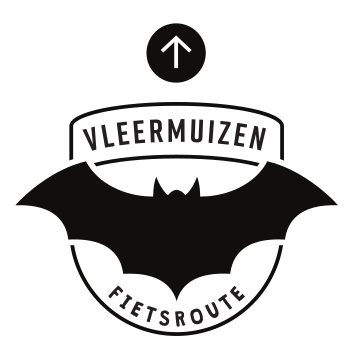
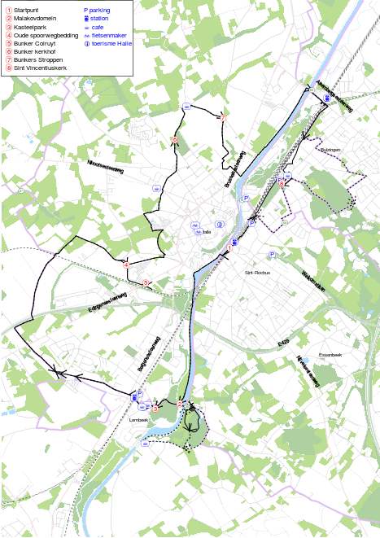
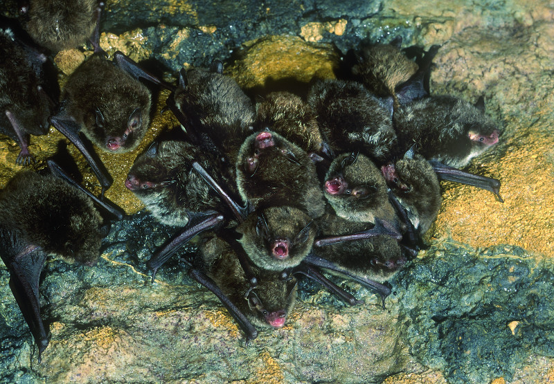
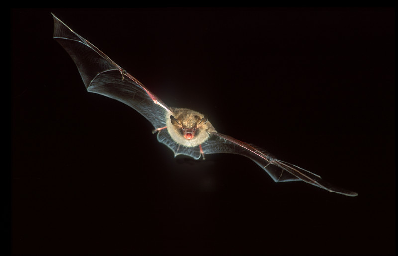
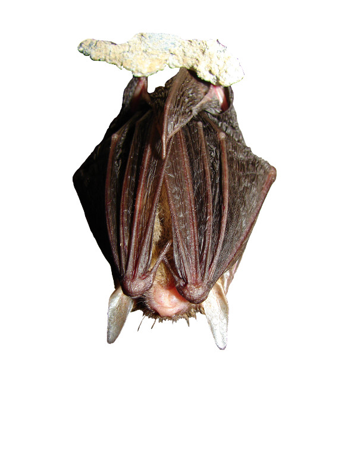
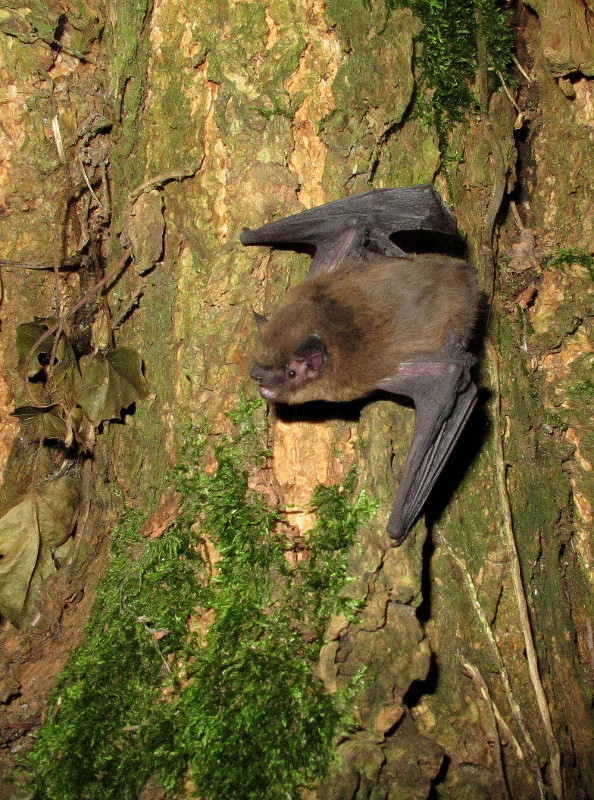
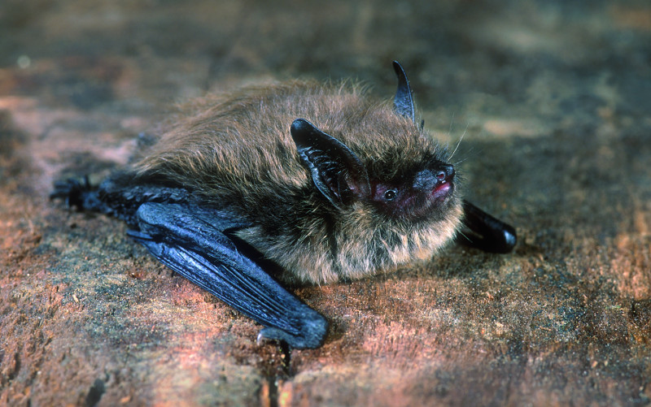
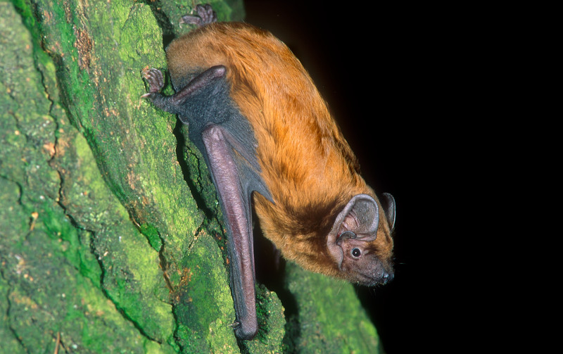
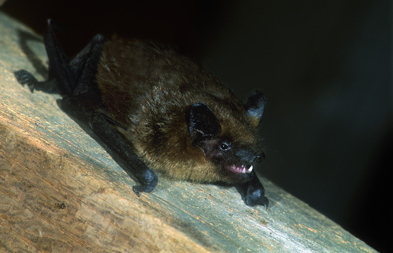

# Inleiding {data-background="images/wegwijzer.svg" data-background-size="auto 80%" data-background-position="bottom"}

## Sprekers

- Vleermuizenwerkgroep Myotis
    - inleiding : Christine Goessens
    - voorstellen infoborden : Thierry Onkelinx
    - voorstellen Erfgoed app : Jan Van Schepdael
- Agentschap voor Natuur en Bos
    - Pierre Kestemont
- Stad Halle
    - burgemeester Dirk Pieters

## Doel van vleermuizenwerkgroep Myotis

- vleermuizen en hun verblijfplaatsen beschermen
- nieuwe winterverblijfplaatsen inrichten
- inventariseren van bossen en parken
- geleide wandelingen
    - 20 mei: vleermuizenwandeling Gooik
    - 19 augustus: Kinderwandeling Huizingen
    - 26 augustus: vleermuizenwandeling Beersel
    - 2 september: stiltewandeling Hallerbos

## Vleermuizenfietsroute

- bewegwijzerde vaste route
- Hallenaren en toeristen bereiken en ook de jeugd door een
quiz
- door middel van 7 borden met info over locatie en over het
leven van vleermuizen
- moderne technieken : internet, QR code, erfgoedapp

## Natura2000

- Europees netwerk van speciale beschermingszones voor planten en dieren
- alle vleermuizen genieten wettelijke bescherming door deze Europese richtlijn
- **bestaat 25 jaar op 21 mei 2017**

# Concept {data-background="images/wegwijzer.svg" data-background-size="auto 80%" data-background-position="bottom"}

## Vrije fietstocht

- 20 km familievriendelijke fietswegen
- start en aankomst station Halle
- 8 informatiepunten
- volledig bewegwijzerd
- [Toerisme Halle](http://www.toerisme-pajottenland.be) verdeelt
    - gratis gedrukte folder met route
- [www.batbike.be](http://www.batbike.be/kaart.html) biedt
    - downloadbare folder met route
    - interactieve kaart
    - GPX tracks

## Kaart

## Feestelijke opening

- zondag 21 mei, vertrek om 13u30 aan station Halle
- in samenwerking met [Fietsersbond Halle](http://www.fietsersbond.be/halle)
- gratis deelname, inschrijven via [www.batbike.be](https://docs.google.com/a/muscardinus.be/forms/d/e/1FAIpQLSemFGxn4_9ltFJXKktX3Jjx5h0YlN8ToA9IpAnANYPsNpSVKg/viewform)
- geleide fietstocht
    - uitleg door vleermuiskenners
    - mogelijkheid tot bezoek van Malakoffkelder en bunker op kerkhof Halle

## Infopunten

- infobord met beknopte informatie
- [www.batbike.be](http://www.batbike.be) biedt meer uitgebreidde informatie
    - over een aspect van vleermuizen
    - over geschiedenis van de locatie
    - de link tussen vleermuizen en de locatie
    - informatie over een soort vleermuis
- extras via de [erfgoedapp](http://erfgoedapp.be/)
    - toont relevante informatie voor de locatie
    - virtueel bezoek binnen in vleermuisobjecten

# Infopunten {data-background="images/wegwijzer.svg" data-background-size="auto 80%" data-background-position="bottom"}

## Station Halle

- start en aankomst van de route
- focus op praktische aspecten
    - overzicht route
    - bewegwijzering
    - beschikbaarheid folder
    - [erfgoedapp](http://erfgoedapp.be/)

## Malakoffdomein

- hoe kunnen vleermuizen zien in het donker
- geschiedenis van het Malakoffdomein
- vleermuis in detail: watervleermuis

## Kasteelpark Lembeek

- wat eten vleermuizen
- geschiendenis van het kasteelpark
- vleermuis in detail: franjestaart

## Oude spoorbedding

- hoe gebruiken vleermuizen het landschap
- geschiedenis van de spoorbedding
- vleermuis in detail: gewone grootoor

## Bunker Colruyt Group

- hoe overbruggen vleermuizen de winter
- camouflage van de bunkers
- vleermuis in detail: gewone dwergvleermuis

## Bunker kerkhof

- fabels over vleermuizen
- bunkers als winterverblijfplaatsen voor vleermuizen
- vleermuis in detail: gewone baardvleermuis

## Bunkers Stroppen

- levencyclus van vleermuizen
- geschiedenis van de bunkerlinie rond Halle
- vleermuis in detail: rosse vleermuis

## Sint-Vincentiuskerk

- vleermuizen tijdens de zomer
- geschiedenis van de kerk + inrichting voor vleermuizen
- vleermuis in detail: laatvlieger

# Samenwerking {data-background="images/wegwijzer.svg" data-background-size="auto 80%" data-background-position="bottom"}

## De vleermuizenfietsroute

- een initiatief van
    - [Vleermuizenwerkgroep Myotis](http://www.batbike.be/voorstelling.html)
- in samenwerking met
    - [Fietsersbond Halle](http://www.fietsersbond.be/halle)
- met steun van
    - [Natuurpunt](www.natuurpunt.be)
    - [Stad Halle](https://www.halle.be/)
    - [Provincie Vlaams-Brabant](http://www.vlaamsbrabant.be/wonen-milieu/milieu-en-natuur/natuur/koesterburen/index.jsp)
    - [Plan Boommarter](http://www.planboommarter.be/boommarter/wat-het-plan/7258)
    - [Agentschap voor Natuur en Bos](https://www.natuurenbos.be/hallerbos)
    - [Colruyt Group](https://www.colruytgroup.be/nl)
    - [Conversion Works](http://www.conversionworks.eu/)
  
