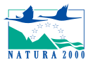

```{r load_packages, include = FALSE}
library(knitr)
opts_chunk$set(
  echo = FALSE,
  message = FALSE,
  warning = FALSE
)
library(htmlwidgets)
setWidgetIdSeed(1)
library(leaflet)
library(tibble)
library(rgdal)
library(readr)
library(dplyr)
library(tidyr)
```


# Inleiding {data-background="images/wegwijzer.svg" data-background-size="auto 80%" data-background-position="bottom"}

## Sprekers

- Vleermuizenwerkgroep Myotis
    - inleiding : Christine Goessens
    - voorstellen infoborden : Thierry Onkelinx
    - voorstellen Erfgoed app : Jan Van Schepdael
- Agentschap voor Natuur en Bos
    - Pierre Kestemont
- Stad Halle
    - burgemeester Dirk Pieters

## Doel van vleermuizenwerkgroep Myotis

- vleermuizen en hun verblijfplaatsen beschermen
- nieuwe winterverblijfplaatsen inrichten
- inventariseren van bossen en parken
- geleide wandelingen
    - 20 mei: vleermuizenwandeling Gooik
    - 19 augustus: Kinderwandeling Huizingen
    - 26 augustus: vleermuizenwandeling Beersel
    - 2 september: stiltewandeling Hallerbos

## Vleermuizenfietsroute

- bewegwijzerde vaste route
- Hallenaren en toeristen bereiken en ook de jeugd door een
quiz
- door middel van 7 borden met info over locatie en over het
leven van vleermuizen
- moderne technieken : internet, QR code, erfgoedapp

## Natura2000

- Europees netwerk van speciale beschermingszones voor planten en dieren
- alle vleermuizen genieten wettelijke bescherming door deze Europese richtlijn
- **bestaat 25 jaar op 21 mei 2017**

# Concept {data-background="images/wegwijzer.svg" data-background-size="auto 80%" data-background-position="bottom"}

## Vrije fietstocht

- 20 km familievriendelijke fietswegen
- start en aankomst station Halle
- 7 + 1 infopunten
- volledig bewegwijzerd
- [Toerisme Halle](http://www.toerisme-pajottenland.be) verdeelt
    - gratis gedrukte folder met route
- [www.batbike.be](http://www.batbike.be/kaart.html) biedt
    - downloadbare folder met route
    - interactieve kaart
    - GPX tracks

## Aanbevolen route

```{r map_data, results='hide'}
route_segment <- readOGR("https://raw.githubusercontent.com/emarginatus/batbike/master/route/route.geojson", "OGRGeoJSON", verbose = FALSE)
knooppunt <- readOGR("https://raw.githubusercontent.com/emarginatus/batbike/master/route/knooppunt.geojson", "OGRGeoJSON", verbose = FALSE)
basis <- read_csv("https://raw.githubusercontent.com/emarginatus/batbike/master/route/route.csv") %>%
  group_by(route) %>%
  mutate(
    vorige = lag(knoop),
    segment = sprintf("%i-%i", pmin(knoop, vorige), pmax(knoop, vorige)),
    omkeren = vorige > knoop,
    id = row_number()
  ) %>%
  filter(!is.na(vorige)) %>%
  select(route, id, segment, omkeren) %>%
  rowwise() %>%
  mutate(
    segment = route_segment[route_segment$segment == segment, ] %>%
      coordinates() %>%
      "[["(1) %>%
      as.data.frame() %>%
      list()
  ) %>%
  unnest(segment, .drop = FALSE) %>%
  group_by(route, id) %>%
  mutate(
    volgorde = ifelse(omkeren, -1, 1) * row_number()
  ) %>%
  arrange(route, id, volgorde) %>%
  group_by(route) %>%
  do(
    lijn = select(., x = X1, y = X2) %>%
      as.data.frame() %>%
      Line() %>%
      list()
  ) %>%
  rowwise() %>%
  mutate(
    lijn = Lines(lijn, route) %>% 
      list() %>%
      SpatialLines(CRS("+proj=longlat +ellps=WGS84")) %>%
      list()
  )
infopunt <- readOGR(
  "https://raw.githubusercontent.com/emarginatus/batbike/master/route/infopunt.geojson", 
  "OGRGeoJSON", 
  verbose = FALSE
)
object <- readOGR(
  "https://raw.githubusercontent.com/emarginatus/batbike/master/route/object.geojson", 
  "OGRGeoJSON", 
  verbose = FALSE
)
object$verblijf <- ifelse(
  object$vleermuis == 0,
  0,
  ifelse(object$winter == 1, 1, 2)
) %>%
  factor(
    levels = 0:2, 
    labels = c("geen vleermuizen", "winterverblijf", "zomerverblijf")
  )
transport <- readOGR(
  "https://raw.githubusercontent.com/emarginatus/batbike/master/route/transport.geojson", 
  "OGRGeoJSON", 
  verbose = FALSE
) %>%
  subset(categorie %in% c("parking", "station"))
```

```{r stijlen}
object_icoon <- awesomeIconList(
  "geen vleermuizen" = makeAwesomeIcon(icon = "building-o", library = "fa"),
  winterverblijf = makeAwesomeIcon(icon = "building", library = "fa", markerColor = "green"),
  zomerverblijf = makeAwesomeIcon(icon = "building", library = "fa", markerColor = "pink")
)
infopunt_icoon <- makeAwesomeIcon(icon = "info", library = "fa", markerColor = "red")
transport_icoon <- awesomeIconList(
  "parking" = makeAwesomeIcon(icon = "car", library = "fa", markerColor = "blue"),
  "station" = makeAwesomeIcon(icon = "train", library = "fa", markerColor = "blue")
)
```

```{r detailkaart, out.width="100%", out.height="600px"}
leaflet() %>%
  addTiles(
    paste0(
      "https://{s}.tile.thunderforest.com/cycle/{z}/{x}/{y}.png?apikey=", 
      Sys.getenv("OCM_API")
    )
  ) %>%
  addPolylines(
    data = basis$lijn[basis$route == "Aanbevolen"][[1]],
    color = "blue",
    group = "aanbevolen"
  ) %>%
  addAwesomeMarkers(
    data = transport, 
    icon = ~transport_icoon[categorie],
    label = ~id,
    group = "transport"
  ) %>%
  addAwesomeMarkers(
    data = infopunt, 
    icon = infopunt_icoon, 
    group = "infopunt"
  ) %>%
  addAwesomeMarkers(
    data = object, 
    icon = ~object_icoon[verblijf], 
    label = ~naam,
    group = "object"
  ) %>%
  addScaleBar(options = scaleBarOptions(maxWidth = 100, imperial = FALSE))
```


## Feestelijke opening

- zondag 21 mei, vertrek om 13u30 aan station Halle
- in samenwerking met [Fietsersbond Halle](http://www.fietsersbond.be/halle)
- gratis deelname, inschrijven via [www.batbike.be](https://docs.google.com/a/muscardinus.be/forms/d/e/1FAIpQLSemFGxn4_9ltFJXKktX3Jjx5h0YlN8ToA9IpAnANYPsNpSVKg/viewform)
- geleide fietstocht
    - uitleg door vleermuiskenners
    - mogelijkheid tot bezoek van Malakoffkelder en bunker op kerkhof Halle

## Infopunten

- infobord met beknopte informatie
- [www.batbike.be](http://www.batbike.be) biedt meer uitgebreide informatie
    - over een aspect van vleermuizen
    - over geschiedenis van de locatie
    - de link tussen vleermuizen en de locatie
    - informatie over vleermuizensoort
- extras via de [erfgoedapp](http://erfgoedapp.be/)
    - toont relevante informatie voor de locatie
    - virtueel bezoek binnen in vleermuisobjecten

# Infopunten {data-background="images/wegwijzer.svg" data-background-size="auto 80%" data-background-position="bottom"}

## Station Halle

- start en aankomst van de route
- focus op praktische aspecten
    - overzicht route
    - bewegwijzering
    - beschikbaarheid folder
    - [batbike.be](http://www.batbike.be)
    - [erfgoedapp](http://erfgoedapp.be/)

## Malakoffdomein

- hoe kunnen vleermuizen zien in het donker
- geschiedenis van het Malakoffdomein
- vleermuis in detail: watervleermuis

<div style="font-size: 30%;"><br>
Foto: Hugo Willocx</div>

## Kasteelpark Lembeek

- wat eten vleermuizen
- geschiedenis van het kasteelpark
- vleermuis in detail: franjestaart

<div style="font-size: 30%;"><br>
Foto: Hugo Willocx</div>

## Oude spoorbedding

- hoe gebruiken vleermuizen het landschap
- geschiedenis van de spoorbedding
- vleermuis in detail: gewone grootoor

<div style="font-size: 30%;"><br>
Foto: David Galens</div>

## Bunker Colruyt Group

- hoe overbruggen vleermuizen de winter
- camouflage van de bunkers
- vleermuis in detail: gewone dwergvleermuis

<div style="font-size: 30%;"><br>
Foto: David Herman</div>

## Bunker kerkhof

- fabels over vleermuizen
- bunkers als winterverblijfplaatsen voor vleermuizen
- vleermuis in detail: gewone baardvleermuis

<div style="font-size: 30%;"><br>
Foto: Hugo Willocx</div>

## Bunkers Stroppen

- levencyclus van vleermuizen
- geschiedenis van de bunkerlinie rond Halle
- vleermuis in detail: rosse vleermuis

<div style="font-size: 30%;"><br>
Foto: Hugo Willocx</div>

## Sint-Vincentiuskerk

- vleermuizen tijdens de zomer
- geschiedenis van de kerk + inrichting voor vleermuizen
- vleermuis in detail: laatvlieger

<div style="font-size: 30%;"><br>
Foto: Hugo Willocx</div>


# Samenwerking {data-background="images/wegwijzer.svg" data-background-size="auto 80%" data-background-position="bottom"}

## De vleermuizenfietsroute

- een initiatief van
    - [Vleermuizenwerkgroep Myotis](http://www.batbike.be/voorstelling.html)
- in samenwerking met
    - [Fietsersbond Halle](http://www.fietsersbond.be/halle)
- met steun van
    - [Natuurpunt](www.natuurpunt.be)
    - [Stad Halle](https://www.halle.be/)
    - [Provincie Vlaams-Brabant](http://www.vlaamsbrabant.be/wonen-milieu/milieu-en-natuur/natuur/koesterburen/index.jsp)
    - [Plan Boommarter](http://www.planboommarter.be/boommarter/wat-het-plan/7258)
    - [Agentschap voor Natuur en Bos](https://www.natuurenbos.be/hallerbos)
    - [Colruyt Group](https://www.colruytgroup.be/nl)
    - [Conversion Works](http://www.conversionworks.eu/)
  
