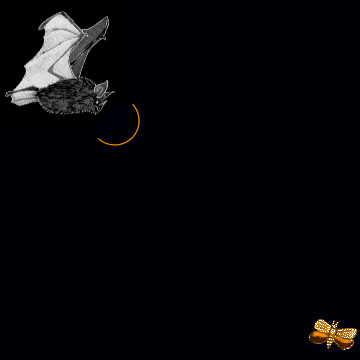
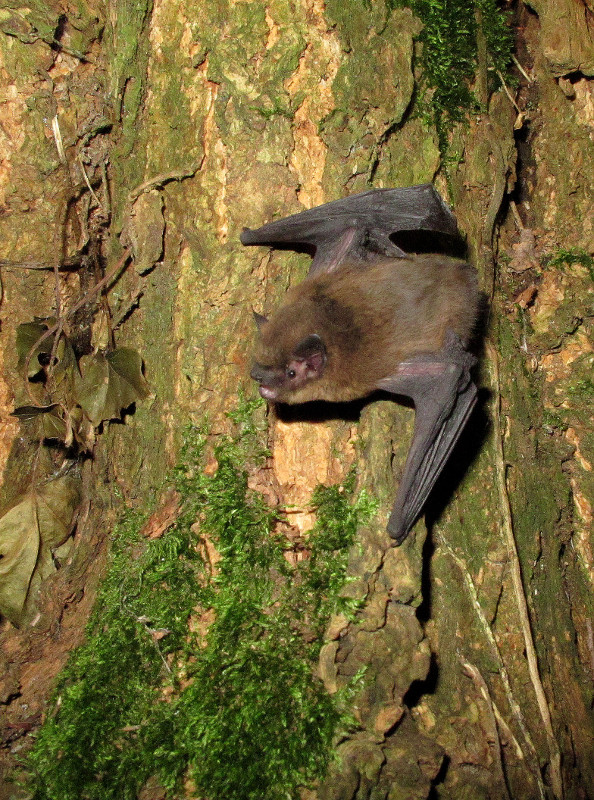
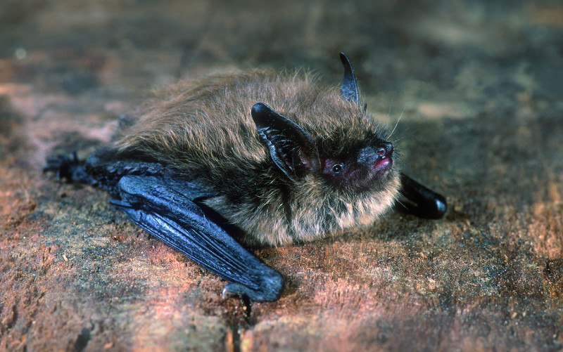

# Vleermuizen {data-background="images/logo.svg" data-background-size="auto 80%" data-background-position="bottom"}

## De fabeltjes

- ze vliegen niet in je haar
- ze eten hoofdzakelijk insecten
      - tropische soorten eten ook fruit of vis
      - enkel 4 Zuidamerikaanse soorten drinken bloed
- ze zijn niet blind

## Wist je dat vleermuizen...

- ... elke nacht tot de helft van hun lichaamsgewicht aan insecten verorberen?
     - dat zijn 2000 muggen!
- een winterslaap van 6 maanden houden
- slechts 1 of 2 jongen per jaar krijgen
- 20 jaar oud kunnen worden
- niet blind zijn
- kunnen "zien" met hun oren

## Vleermuizen kunnen "zien" in het donker

- Vleermuizen gebruiken echolocatie
- Ze stoten hoge, korte geluiden uit en luisteren naar de echo
- Hoe langer de tijd tussen roepen en echo, hoe verder het object

## Batdetectors

- Vleermuizen gebruiken **ultrasone** geluiden
    - niet hoorbaar voor de mens
- Batdetectors maken het geluid hoorbaar voor mensen

# Vleermuizen van bij ons {data-background="images/logo.svg" data-background-size="auto 80%" data-background-position="bottom"}

## Gewone dwergvleermuis

## Watervleermuis

## Baardvleermuis

## Franjestaart

## Gewone grootoor

## Laatvlieger

## Rosse vleermuis

# De werkgroep {data-background="images/logo.svg" data-background-size="auto 80%" data-background-position="bottom"}

## Wie zijn we

## Wat doen we

- adviseren bij een vleermuisvriendelijk beheer
    - vleermuizen in spouwen en zolders van particulieren
    - vleermuizen op zolders van historische gebouwen
    - beheer van koloniebomen
- onderzoek naar het voorkomen van vleermuizen
- inrichten van winterverblijfplaatsen

## Inrichten van winterverblijfplaatsen

# Vleermuizenfietsroute  {data-background="images/logo.svg" data-background-size="auto 80%" data-background-position="bottom"}

## Kom in contact met de wondere wereld van vleermuizen

- familievriendelijke fietstocht
    - 20 km, 161 hoogtemeters
- vertrek en einde aan station Halle
- 8 infoborden
    - in de buurt van locaties die belangrijk zijn voor vleermuizen
    - extra informatie via www.batbike.be
- neem een virtueel kijkje in de vleermuislocaties via de [Erfgoedapp](www.erfgoedapp.be)

## Kaart

## Folder met kaart

- Beschikbaar via toeristische dienst
- Gratis te [downloaden](http://www.batbike.be) via www.batbike.be
- [GPX track](http://batbike.be/route/route.gpx) beschikbaar via www.batbike.be

# Publieksactiviteiten {data-background="images/logo.svg" data-background-size="auto 80%" data-background-position="bottom"}

## Inhuldiging vleermuizenfietsroute

www.batbike.be

- 21 mei 2017 13u
- vertrek aan Station Halle
- gratis deelname
- inschrijven gewenst

## Vleermuizenwandeling voor kinderen

Op een speelse manier laten we ons meeslepen in de wereld van de vleermuis. Deze kleine, zachte en nuttige zoogdieren worden nog al te vaak geassocieerd met bloeddorstige vampieren. Tijd om hier verandering in te brengen! Vanzelfsprekend zijn volwassenen ook welkom.

- 19 augustus 2017
- 19u30 tot 21u30
- Provinciaal domein Huizingen

## Nacht van de Vleermuis

Dit jaar zoeken we naar vleermuizen in een uniek kader, met name het kasteel van Beersel.
Met vleermuizen-gidsen en met batdetector gaan we op stap. Het kasteel staat er nog zoals het er uitzag aan het einde van de 15de eeuw, misschien voelen we ons samen met de vleermuizen even terug in de tijd van ridders en jonkvrouwen ?

Deze activiteit wordt georganiseerd in samenwerking met de [milieuraad Beersel](https://www.beersel.be/product/1162/milieuraad)

- 26 augustus 2017
- 20u00 tot 23u00
- kasteel van Beersel

## Stiltewandeling en de geheimen van bosuil en vleermuis

We genieten van de stilte, enkel een roepende bosuil kan deze doorbreken. Dit geluid doet de schaduwen zwarter lijken maar net dit maakt deze wandeling uniek.

- 2 september 2017
- 19u30 tot 0u00
- Achtdreven, [Hallerbos](www.hallerbos.be)
